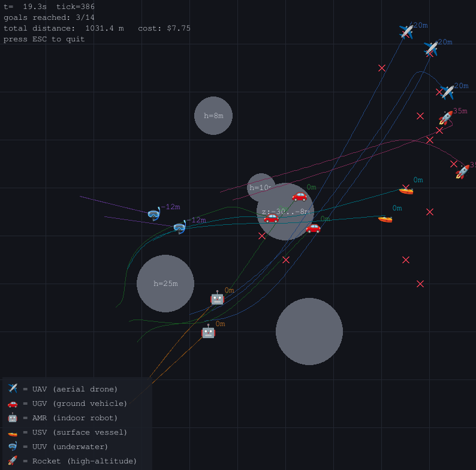
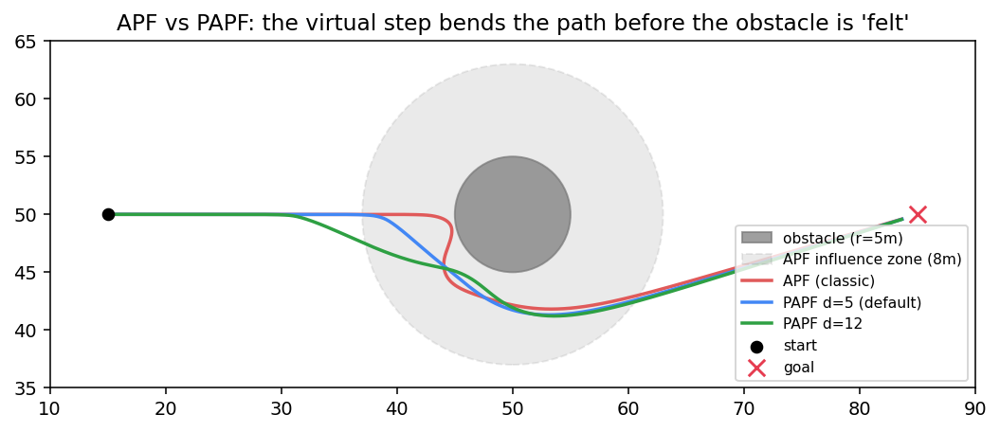
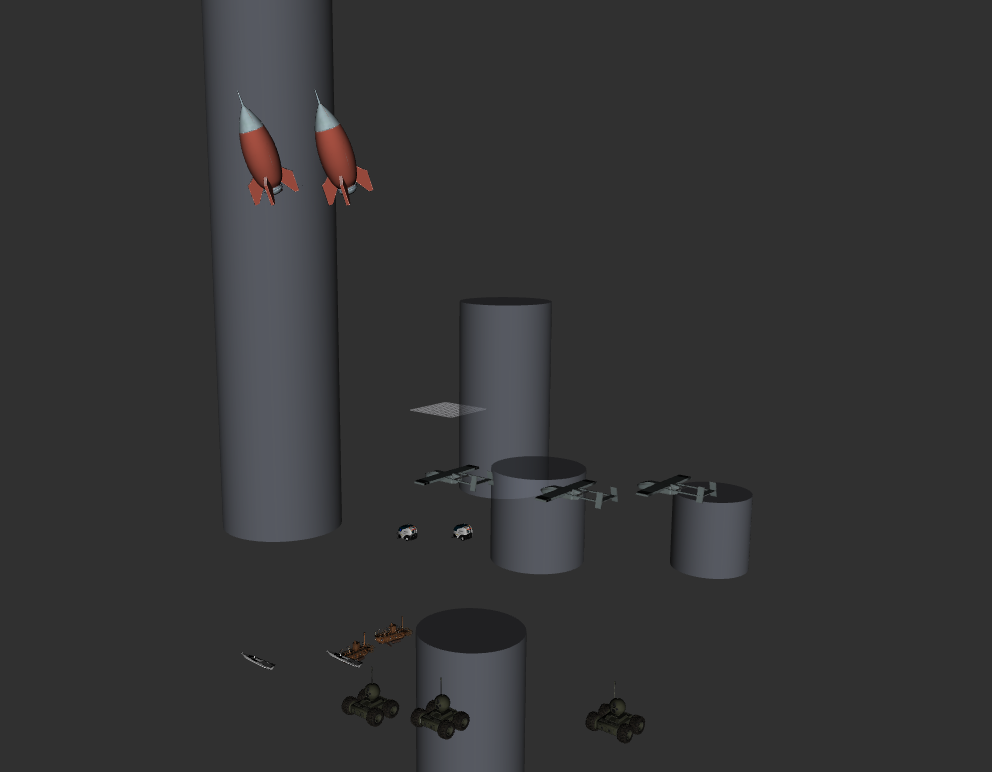

# Heterogeneous Swarm Simulation Engine

A heterogeneous multi-agent swarm simulation engine developed with Python:
**UAV, UGV, AMR, USV, UUV, and Rocket**, consisting of six agent types.



*Pygame window: agents are drawn as emojis, statistics HUD on the top left,
emoji descriptions (legend) on the bottom left. Altitude (20m, 35m) labels
appear next to aircraft, and depth (−12m) labels appear next to UUVs.*

---

## 1. Installation

```bash
git clone <repo-url>
cd simulation
python -m venv .venv && source .venv/bin/activate   # Windows: .venv\Scripts\activate
pip install -r requirements.txt
```

Requirements: Python ≥ 3.10, `numpy`, `pygame` (visualization), `matplotlib`
(graph output), `pytest` + `pytest-cov` (tests). For the ROS2 bridge, an
installed ROS2 distribution (Humble/Jazzy) is also required — see Section 7.

## 2. Execution

```bash
python main.py                        # default: ALL agent types, PAPF (d=5)
python main.py --algo apf             # run with classic APF
python main.py --d=10                 # PAPF, virtual step length 10 m
python main.py --headless             # run without GUI, print statistics
python main.py --headless --plot out.png  # save trajectory graph as PNG
python main.py --ticks 10000          # change maximum number of ticks
```

### Coordination algorithm selection

`--algo papf` (default) uses predictive APF, `--algo apf` uses classic APF.
`--d` only determines the virtual step length (meters) of PAPF; if not provided,
the default **d = 5.0 m** is used.

```bash
python main.py uav rocket --d=12      # filtering + PAPF step length combined
```

### Agent type filtering

If type names are provided as positional arguments, **only those types** will be simulated
and displayed. If no types are provided, all agents will run (default).

```bash
python main.py uav                    # only UAVs
python main.py rocket                 # only rockets
python main.py uav ugv                # only UAV + UGV
python main.py usv uuv rocket         # only marine vehicles + rocket
```

Valid type names: `uav`, `ugv`, `amr`, `usv`, `uuv`, `rocket`
(case-insensitive). The legend on the bottom left of the window only lists the
types currently present in the simulation.

### Window legend

Agents are shown as emojis in the window:

| Emoji | Agent |
|---|---|
| ✈️ | UAV — aerial vehicle |
| 🚗 | UGV — ground vehicle |
| 🤖 | AMR — indoor robot |
| 🚤 | USV — surface vehicle |
| 🤿 | UUV — underwater vehicle |
| 🚀 | Rocket — high altitude |

If the system does not have a color emoji font (Noto Color Emoji, Segoe UI Emoji, etc.),
the visualizer automatically falls back to colored geometric shapes (blue triangle =
UAV, green square = UGV, ...) and the legend text is updated accordingly. On Linux,
for emoji font: `sudo apt install fonts-noto-color-emoji`

Red crosses indicate goals, gray disks indicate obstacles. `h=25m` indicates
obstacle height, `z:-30..-8m` indicates the depth range of an underwater obstacle.
Exit the window with `ESC`.

### Tests

```bash
python -m pytest --cov --cov-report=term
```

Current status: **83 tests, 98% line coverage** (KPI threshold: ≥60%).
Tests include the **SPEED** (no max speed violation), **ACCELERATION** (acceleration limit),
**POSITION** (position integration, plane/altitude/depth constraints)
verifications required in the KPI for all six agent types.

## 3. Architecture

```text
simulation/
├── dae/                    # 3D models of agents for RViz (UAV, UGV, etc.)
├── docs/                   # Documentation images (screenshots, graphs)
├── src/
│   ├── agents.py           # BaseAgent (ABC) → UAV, UGV, AMR, USV, UUV, Rocket
│   ├── coordination.py     # APF + PAPF (predictive) coordination algorithms
│   ├── engine.py           # Sense → Think → Act tick loop
│   ├── environment.py      # World boundaries + cylindrical obstacles with depth bands
│   ├── math_utils.py       # numpy vector helpers
│   ├── ros2_bridge.py      # [BONUS] ROS2 node wrapper (RViz publishing)
│   ├── scenario.py         # Demo scenario + agent type filtering
│   └── visualizer.py       # pygame bird's-eye view visualization (English interface)
├── tests/
│   ├── test_agents.py      # Agent kinematics (speed, acceleration, position) tests
│   ├── test_coordination.py# APF algorithm tests
│   ├── test_engine.py      # Tick mechanism and system integration tests
│   ├── test_math_utils.py  # Vector helper function tests
│   ├── test_new_agents.py  # Custom physics tests for USV, UUV, and Rocket
│   └── test_papf.py        # Predictive APF (PAPF) verification tests
├── main.py                 # CLI entry point (type filtering flags)
├── pytest.ini              # pytest configuration
└── requirements.txt        # Project dependencies
```

### Sense → Think → Act loop

The heart of the engine is the three-phase loop inside `SimulationEngine.tick()`:

1. **Sense:** Each agent scans its neighbors within sensor range and
   obstacles *blocking its own altitude/depth*.
2. **Think:** The coordination strategy (APF) calculates an acceleration vector
   from goal, obstacle, and neighbor information using `numpy` vector operations.
3. **Act:** Acceleration is integrated, type-specific kinematic constraints are
   applied, and position is updated.

Important detail: within a tick, **all agents first sense and think, then
they all move simultaneously**. Thus, every decision is based on the same world snapshot,
preventing bias caused by agent ordering.

### OOP hierarchy

```text
BaseAgent (ABC)
├── UAV               → 3D movement, altitude band [min, max], frictionless
│   └── Rocket        → fastest agent; flies near ceiling (35 m), fin-constrained
│                        wide turns (25°/s)
├── GroundAgent       → fixed to z=0 plane, ground/hull friction
│   ├── UGV           → turn rate constraint (vehicle steering, 90°/s)
│   ├── AMR           → omnidirectional but slow (indoor robot)
│   └── USV           → water surface, hull drag + rudder constraint (60°/s)
└── UnderwaterAgent   → negative z, depth band, water resistance on 3 axes
    └── UUV           → slow sonar exploration submarine (45°/s)
```

Subclasses only override the `_constrain_velocity()` and `_post_move()` hooks;
the sense/think/act flow lives entirely in `BaseAgent` (template
method pattern). The turn constraint logic is common in the `limit_turn()` function and
is shared by UGV, USV, and rocket.

## 4. Coordination Algorithms: APF and PAPF

### APF (classic)

`ArtificialPotentialField` sums three force components:

| Component | Formula | Purpose |
|---|---|---|
| Attraction | `k_att · (goal − pos)`, limited by saturation radius | heading to goal |
| Repulsion | `k_rep · (1/d − 1/d₀) · 1/d²` | obstacle avoidance |
| Separation | same form as repulsion, applied to neighbors | in-swarm collision avoidance |

Two practical improvements were added:

* **Tangential component (`k_tangent`):** When the obstacle is exactly in the goal direction,
  attraction and repulsion remain anti-parallel and the agent gets stuck in a local minimum.
  By adding a tangential component aligned with the goal direction to the repulsive force, the agent
  is steered *around* the obstacle.
* **Attraction saturation (`attraction_saturation`):** To prevent attraction from growing
  boundlessly and overwhelming repulsion for distant goals, the attraction force is
  capped after a certain distance.

### PAPF (predictive)

Classic APF only "feels" an obstacle after entering its radius of influence (d₀ = 8 m)
and makes late, harsh corrections. `PredictiveArtificialPotentialField`
adds a **virtual (imaginary) step** to this: the agent calculates its imaginary position `d` meters
ahead in the current direction of motion and evaluates the repulsion/separation field at that point as well:

```text
p_virtual = p + d · unit(v)         (towards goal if stationary)
F = F_attraction(p) + F_repulsion(p) + w · F_repulsion(p_virtual) − damping · v
```

Because the path is bent based on what *will be* `d` meters ahead, the agent begins
avoidance before reaching the obstacle. The `--d` flag determines this step length
(default 5.0 m).



Measured behavior in a head-on scenario (UGV, r=5 m obstacle):

| Algorithm | Min. obstacle distance | Path length |
|---|---|---|
| APF (classic) | 0.41 m | — (skims the surface) |
| PAPF d=2 | 2.23 m | 73.9 m |
| PAPF d=5 (default) | 2.22 m | 72.5 m |
| PAPF d=12 | 1.62 m | 71.7 m |

At any `d` value, PAPF leaves a **3–5 times larger safety margin**
than classic APF. As `d` increases, avoidance begins earlier and the path shortens;
the minimum distance during the transition slightly decreases because it is predominantly
determined by the instantaneous (non-predictive) term — meaning `d` is a design parameter
tuning the trade-off between early reaction ↔ path efficiency. These behaviors
are verified in `tests/test_papf.py`.

## 5. Agent Parameter Sets

| Parameter | UAV | UGV | AMR | USV | UUV | Rocket |
|---|---|---|---|---|---|---|
| Max. speed (m/s) | 15.0 | 5.0 | 2.0 | 8.0 | 3.0 | 30.0 |
| Max. acceleration (m/s²) | 6.0 | 2.5 | 1.5 | 3.0 | 1.2 | 12.0 |
| Sensor range (m) | 40 | 20 | 12 | 30 | 15 | 35 |
| Task capacity (kg) | 2.5 | 80 | 30 | 200 | 50 | 10 |
| Cost ($/hour) | 120 | 45 | 25 | 60 | 90 | 300 |
| Friction/drag (1/s) | — | 0.6 | 0.8 | 0.5 | 0.9 | — |
| Max. turn rate (°/s) | ∞ | 90 | ∞ | 60 | 45 | 25 |

Parameters are defined in the `DEFAULT_SPECS` dictionary within `src/agents.py` and
can be assigned individually to each agent instance via the `AgentSpec` dataclass.

### Obstacle model: depth bands

Obstacles are vertical cylinders extending in the range `[base, base + height)` and only
affect an agent if the agent's z-coordinate is within this band:

* `h=10m` (base=0): A UAV flying at 20 m does not detect it, ground vehicles navigate around it.
* `height=inf`: no-fly column — impassable for both air and ground.
* `z:-30..-8m` seamount: blocks a UUV cruising at −12 m;
  UAV/UGV and a rocket flying at 35 m are entirely unaffected.
* Rocket flies at 35 m, above all finite obstacles on the map — it can only be
  affected by a no-fly column of infinite height.

## 6. KPI Fulfillment

| KPI | Status |
|---|---|
| ≥3 agent types simulated? | ✅ 6 types: UAV + UGV + AMR + USV + UUV + Rocket (✈️🚗🤖🚤🤿🚀) |
| Coordination algorithm | ✅ APF + PAPF (predictive), both tested and operational |
| Type-specific parameter set | ✅ speed, range, capacity, cost/hour (`DEFAULT_SPECS`) |
| Unit test coverage ≥ 60% | ✅ 99% (70 tests; including speed/acceleration/position validations) |
| README.md | ✅ installation, execution, parameter explanations |
| [BONUS] ROS2 node + RViz | ✅ `src/ros2_bridge.py` (below) |

## 7. [BONUS] ROS2 Node + RViz Visualization



Because `SimulationEngine` is completely decoupled from visualization, the ROS2
wrapper merely calls `engine.tick()` inside a timer callback and publishes the
state. It accepts the **exact same flags** as `main.py`: type filtering,
`--algo {apf, papf}` and `--d`. Since the algorithm lives inside the engine
(Strategy pattern), RViz visualization works with the same topics for both APF and PAPF,
without requiring additional configuration.

```bash
source /opt/ros/humble/setup.bash          # or jazzy
python -m src.ros2_bridge                  # all types, PAPF d=5 (default)
python -m src.ros2_bridge --algo apf       # classic APF
python -m src.ros2_bridge --d=10           # PAPF, virtual step 10 m
python -m src.ros2_bridge uav rocket --d=12  # filtering + PAPF combined
```

The selected algorithm is logged at startup
(`Coordination: PAPF (d=10.0 m)`), so the publishing mode can be
verified from the `ros2 node` output.

Published topics:

| Topic | Message type | Content |
|---|---|---|
| `/swarm/markers` | `visualization_msgs/MarkerArray` | agents (type-colored primitives) + obstacles (cylinder) |
| `/swarm/poses` | `geometry_msgs/PoseArray` | raw agent poses |

RViz setup: **Fixed Frame** = `map`, then add a **MarkerArray** display for the
`/swarm/markers` topic. Agent colors are identical to the pygame visualizer;
obstacles are rendered as translucent gray cylinders. If `rclpy` is not
installed, the module exits with an explanatory error message.

## 8. Future Work

* Additional coordination strategies (Reynolds Flocking, GWO) — can be added
  without touching the engine code thanks to the `CoordinationStrategy` interface.
